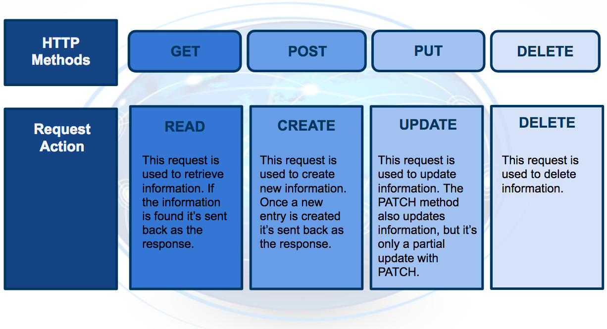

# Deployment of Machine Learning Models:
There are three primary components of deployments. These are -
  > * Explore and process data. 
  > * Modeling or model your data. 
  > * Deployment or deploy your model.
  
   

* **Cloud Computing:** Cloud computing can simply be thought of as transforming an Information Technology (IT) product into a service. With our vacation photos example, we transformed storing photos on an IT product, the flash drive; into storing them using a service, like Google Drive. Using a cloud storage service provides the benefits of making it easier to access and share your vacation photos, because you no longer need the flash drive. 
  * **Why would a business decide to use cloud computing?** Most of the factors related to choosing cloud computing services, instead of developing on-premise IT resources are related to time and cost. The capacity utilization graph below shows how cloud computing compares to traditional infrastructure (on-premise IT resources) in meeting customer demand.
  
 

  
  * **Benefits of Risks Associated with Cloud Computing:**
  
    * **Benifits:**  
      **1.** Reduced Investments and Proportional Costs (providing cost reduction). 
      **2.** Increased Scalability (providing simplified capacity planning). 
      **3.** Increased Availability and Reliability (providing organizational agility). 
      
    * **Risks:**  
      **1.** (Potential) Increase in Security Vulnerabilities. 
      **2.** Reduced Operational Governance Control (over cloud resources). 
      **3.** Limited Portability Between Cloud Providers. 
      **4.** Multi-regional Compliance and Legal Issues. 
      
### Paths to Deployment:
Followings are the three steps to deploy a model using Amazon's Sagemaker -
  - **Python model is recoded into the programming language of the production environment:** The first method which involves recoding the Python model into the language of the production environment, often Java or C++. This method is rarely used anymore because it takes time to recode, test, and validate the model that provides the same predictions as the original.
  - **Model is coded in Predictive Model Markup Language (PMML) or Portable Format Analytics (PFA):** The second method is to code the model in Predictive Model Markup Language (PMML) or Portable Format for Analytics (PFA), which are two complementary standards that simplify moving predictive models to deployment into a production environment. The Data Mining Group developed both PMML and PFA to provide vendor-neutral executable model specifications for certain predictive models used by data mining and machine learning.
  - **Python model is converted into a format that can be used in the production environment:** The third method is to build a Python model and use libraries and methods that convert the model into code that can be used in the production environment. Specifically most popular machine learning software frameworks, like PyTorch, TensorFlow, SciKit-Learn, have methods that will convert Python models into intermediate standard format, like ONNX (Open Neural Network Exchange format). This intermediate standard format then can be converted into the software native to the production environment.
  
   

#### NOTE:
  - Cloud Computing can be used for any or all parts of the machine learning process.
  - **Environment** is the computational system that host the application. Types of the environment depends on the types of users. With examples, if we are providing predictions to the users who are customer then its called `production environment`, and if the users are emplyees testing the applicatin it would be the `test environment`.
  - **Endpoint:** Application communicates with the model through an interface to the model called endpoint.
    - Allows the application to send user data to the model and
    - Receives predictions back from the model based upon that user data.
   One way to think of the endpoint that acts as this interface, is to think of a Python program where:
    - the endpoint itself is like a function call
    - the function itself would be the model and
    - the Python program is the application.
    
 
  
  
  
### Endpoint and REST API
Communication between the application and the model is done through the endpoint (interface), where the endpoint is an Application Programming Interface (API).
  - An easy way to think of an API, is as a set of rules that enable programs, here the application and the model, to communicate with each other.
  - In this case, our API uses a REpresentational State Transfer, REST, architecture that provides a framework for the set of rules and constraints that must be adhered to for communication between programs.
  - This REST API is one that uses HTTP requests and responses to enable communication between the application and the model through the endpoint (interface).
  - Noting that both the HTTP request and HTTP response are communications sent between the application and model.

### HTTP Request:
The HTTP request that’s sent from your application to your model is composed of four parts:

  - **Endpoint:**
This endpoint will be in the form of a URL, Uniform Resource Locator, which is commonly known as a web address.
  - **HTTP Method:**
Below you will find four of the HTTP methods, but for purposes of deployment our application will use the POST method only.
  - **HTTP Headers:**
The headers will contain additional information, like the format of the data within the message, that’s passed to the receiving program.
  - **Message (Data or Body):**
The final part is the message (data or body); for deployment will contain the user’s data which is input into the model.

 

### HTTP Response:
The HTTP response sent from your model to your application is composed of three parts:
  - **HTTP Status Code:**
If the model successfully received and processed the user’s data that was sent in the message, the status code should start with a 2, like 200.
  - **HTTP Headers:**
The headers will contain additional information, like the format of the data within the message, that’s passed to the receiving program.
  - **Message (Data or Body):**
What’s returned as the data within the message is the prediction that’s provided by the model.
 
This prediction is then presented to the application user through the application. The endpoint is the interface that enables communication between the application and the model using a REST API.
 
As we learn more about RESTful API, realize that it's the application’s responsibility:
  - To format the user’s data in a way that can be easily put into the HTTP request message and used by the model.
  - To translate the predictions from the HTTP response message in a way that’s easy for the application user’s to understand.

### Characteristics of Modeling:
  - **Hyperparameters:**
In machine learning, a hyperparameter is a parameter whose value cannot be estimated from the data.

    - Specifically, a hyperparameter is not directly learned through the estimators; therefore, their value must be set by the model developer.
    - This means that hyperparameter tuning for optimization is an important part of model training.
    - Often cloud platform machine learning services provide methods that allow for automatic hyperparameter tuning for use with model training.
   
  If the machine learning platform fails to offer an automatic hyperparameter option, one option is to use methods from scikit-learn Python library for hyperparameter tuning. Scikit-learn is a free machine learning Python library that includes methods that help with hyperparameter tuning.
  
 

### Characteristics of Deployment:
  - **Model Versioning:**
One characteristic of deployment is the version of the model that is to be deployed.

    - Besides saving the model version as a part of a model’s metadata in a database, the deployment platform should allow one to indicate a deployed model’s version. 
This will make it easier to maintain, monitor, and update the deployed model.

  - **Model Monitoring:**
Another characteristic of deployment is the ability to easily monitor your deployed models.

    - Once a model is deployed you will want to make certain it continues to meet its performance metrics; otherwise, the application may need to be updated with a better performing model.
    
  - **Model Updating and Routing:**
The ability to easily update your deployed model is another characteristic of deployment.

    - If a deployed model is failing to meet its performance metrics, it's likely you will need to update this model. 
    
If there's been a fundamental change in the data that’s being input into the model for predictions; you'll want to collect this input data to be used to update the model.

    - The deployment platform should support routing differing proportions of user requests to the deployed models, to allow comparison of performance between the deployed model variants.
    
  **Routing** in this way allows for a test of a model performance as compared to other model variants.
  
  - **Model Predictions:**
Another characteristic of deployment is the type of predictions provided by your deployed model. There are two common types of predictions:

    - **On-demand predictions:** On-demand predictions might also be called:
      - online,
      - real-time, or
      - synchronous predictions  
      
      With these type of predictions, one expects:
        - a low latency of response to each prediction request,
        - but allows for possibility high variability in request volume.
        
    - **Batch predictions:** Batch predictions might also be called:
      - asynchronous, or
      - batch-based predictions.  
      
      With these type of predictions, one expects:
        - high volume of requests with more periodic submissions
        - so latency won’t be an issue.
        
    - **NOTE:**
      - On-demand predictions are commonly used to provide customers, users, or employees with real-time, online responses based upon a deployed model. Thinking back on our magic eight ball web application example, users of our web application would be making on-demand prediction requests.
      - Batch predictions are commonly used to help make business decisions. For example, imagine a business uses a complex model to predict customer satisfaction across a number of their products and they need these estimates for a weekly report. This would require processing customer data through a batch prediction request on a weekly basis.
      
       
      
 

