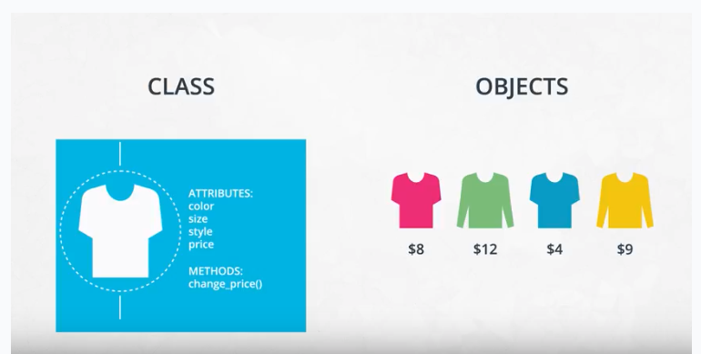

# Vocabulary

* **class** - a blueprint consisting of methods and attributes
* **object** - an instance of a class. It can help to think of objects as something in the real world like a yellow pencil, a small dog, a blue shirt, etc. However, as you'll see later in the lesson, objects can be more abstract.

 

* **attribute** - a descriptor or characteristic. Examples would be color, length, size, etc. These attributes can take on specific values like blue, 3 inches, large, etc.
* **method** - an action that a class or object could take
* **OOP** - a commonly used abbreviation for object-oriented programming
* **encapsulation** - one of the fundamental ideas behind object-oriented programming is called encapsulation: you can combine functions and data all into a single entity. In object-oriented programming, this single entity is called a class. Encapsulation allows you to hide implementation details much like how the scikit-learn package hides the implementation of machine learning algorithms.
* **Function VS Method:** A function and a method look very similar. They both use the def keyword. They also have inputs and return outputs. The difference is that a method is inside of a class whereas a function is outside of a class.
* **Access Attributes:** Accessing attributes directly would be frowned upon in many other languages but not in Python. Instead, the general object-oriented programming convention is to use methods to access attributes or change attribute values. These methods are called set and get methods or setter and getter methods. A get method is for obtaining an attribute value. A set method is for changing an attribute value. Though Python is looser in case of OOP, python allows to access and modify the attribute's value directly.

* **Inheritance:** Inheritance makes code easier to maintain since you can update a parent class once rather than updating all of the children. If a class inherited from a class then adding methods or attributes to that parent class will be inherited to the children classes autometically. Updates to a parent class autometically trickle down to its children.

* **Module:** Python Module is a python file that contains a collection of functions, classes and or global variables. Modules can be used in different Python applications.

* **Package:**  A package is a collections of modules. Every package contains `__init__.py` file. this file tells python that this folder contains package and help us to install package usinf `pip` command.

* **pip:** Pip is a Python package manager that helps with installing and uninstalling Python packages. You might have used pip to install packages using the command line: pip install numpy. When you execute a command like pip install numpy, pip will download the package from a Python package repository called [PyPi](https://pypi.org/)

* **Object-Oriented Programming and Python Packages:** Most if not all of the popular Python packages take advantage of object-oriented programming for a few reasons:
  * Object-oriented programs are relatively easy to expand especially because of inheritance
  * Object-oriented programs obscure functionality from the user. Consider scipy packages. You don't need to know how the actual code works in order to use its classes and methods.

* **Python Environments:** There are two different Python environment managers: conda and venv. You can create virtual environments with either one.
  * **Conda:** Conda does two things: manages packages and manages environments. As an environment manager, conda allows you to create silo-ed Python installations. With an package manager, you can install packages on your computer without affecting your main Python installation. Conda was invented because pip could not handle data science packages that depended on libraries outside of Python. To install packages in caonda environment locally using `pip` one has to install pip in the conda environment first.
  * **pip and Venv:** There are other environmental managers and package managers besides conda. For example, venv is an environment manager that comes pre-installed with Python 3. Pip is a package manager.
    - `packagename.__file__` To see where the package is installed.
    - `pip install .` Pip look for setup.py file to install a package that is described in the setup.py file. Every package contains `setup.py` file in the same directory where the package is, with metadata about the package.
